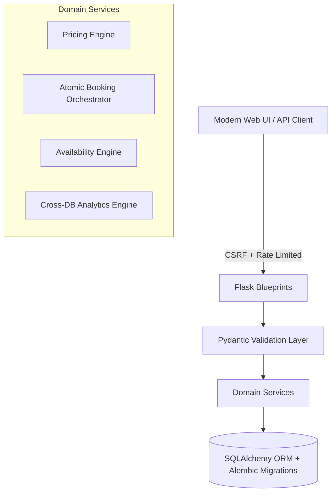

# 🏸 CourtBook Pro — Enterprise Sports Court Booking Platform

[](https://courtbook-pro-4c7j.onrender.com/)
[](https://python.org)
[](https://flask.palletsprojects.com/)
[](https://neon.tech)

An industry-standard, full-stack multi-resource court reservation and complex management platform built with **Python**, **Flask 3+**, **SQLAlchemy 2.0**, **Pydantic**, and a responsive **Vanilla CSS Design System**.

---

## 🌐 Live Production Deployment

👉 **Live URL**: **[https://courtbook-pro-4c7j.onrender.com/](https://courtbook-pro-4c7j.onrender.com/)**

### ⚡ Quick Demo Credentials

| Role | Username | Password | Access Area |
| :--- | :--- | :--- | :--- |
| **👑 Admin** | `admin` | `Admin@123456` | Full Access: Operations Console, Courts, Coaches, Stock, Pricing & Master Bookings |
| **🏸 Player** | `demo_user` | `Demo@123456` | Player Access: Court Reservation Hub & Match History |

*(You can also use the 1-Click Quick Login buttons on the login page)*

---

## 🌟 Key Highlights & Enterprise Architecture

*   **🔒 Concurrency-Safe Physical Slot Locking**: Prevents race conditions and double-booking on multi-hour reservations via unique database constraints on individual atomic hourly slots (`booking_slots`).
*   **💰 Authoritative Server-Side Pricing Engine**: Dynamic pricing logic (Peak Hours, Weekend Multipliers, Indoor Surcharges, Multi-Hour Discounts, and Equipment Bundle Discounts) is calculated and enforced strictly on the backend, preventing client-side price tampering.
*   **🏗️ Layered Architecture & Application Factory**: Strict separation of concerns (Routers $\rightarrow$ Schemas $\rightarrow$ Domain Services $\rightarrow$ ORM Models).
*   **🛡️ Robust Security & Access Control**:
    *   Argon2/PBKDF2 password hashing with strict length/complexity rules.
    *   CSRF protection across all forms and JSON API endpoints (`X-CSRFToken`).
    *   Rate limiting on sensitive endpoints via `Flask-Limiter`.
    *   Secure admin provisioning via CLI (`python cli.py create-admin`).
*   **🗄️ Cross-Database Compatible & Versioned Migrations**:
    *   Database-agnostic queries supporting both **SQLite** (local development) and **PostgreSQL** (production).
    *   Automated schema migrations powered by **Flask-Migrate** (Alembic).
*   **🧪 Automated Testing Suite**: Complete unit, integration, and security test coverage with **Pytest**.
*   **🎨 Glassmorphic Custom Design System**: Clean, responsive UI with live pricing breakdowns, time-chip selectors, and executive analytics KPI dashboards.

---

## 🏛️ System Architecture



---

## 📂 Project Structure

```
Sports Court Booking Platform/
├── app/
│   ├── __init__.py            # Application factory (create_app)
│   ├── config.py              # Environment configuration classes
│   ├── extensions.py          # Initialized Flask extensions
│   ├── models/                # SQLAlchemy ORM Models
│   │   ├── user.py
│   │   ├── court.py
│   │   ├── equipment.py
│   │   ├── coach.py
│   │   ├── booking.py         # Booking, BookingSlot, BookingEquipment
│   │   └── pricing_rule.py
│   ├── schemas/               # Pydantic input validation schemas
│   ├── services/              # Domain business logic
│   │   ├── pricing_service.py
│   │   ├── booking_service.py
│   │   ├── availability_service.py
│   │   └── analytics_service.py
│   ├── blueprints/            # Route controllers
│   │   ├── auth/              # Authentication & user profile
│   │   ├── main/              # Customer views
│   │   ├── admin/             # Admin management views
│   │   └── api/               # RESTful v1 JSON API
│   └── utils/                 # Decorators, errors, responses
├── migrations/                # Alembic database migration scripts
├── static/
│   ├── css/design_system.css  # Unified design tokens & components
│   └── js/
│       ├── api_client.js      # Fetch client with auto-CSRF
│       ├── booking.js         # Interactive customer booking flow
│       └── admin.js           # Admin management & live charts
├── templates/                 # Modular Jinja2 templates
│   ├── base.html
│   ├── home.html
│   ├── login.html
│   ├── signup.html
│   └── admin_dashboard.html
├── tests/                     # Pytest automated test suite
├── cli.py                     # Management CLI commands
├── run.py                     # WSGI / Dev entry point
├── render.yaml                # Production deployment descriptor
└── requirements.txt           # Pinned production dependencies
```

---

## 🚀 Getting Started

### 1. Prerequisites
*   Python 3.10+ installed on your system.

### 2. Environment Setup
```bash
# 1. Create and activate a virtual environment
python3 -m venv .venv
source .venv/bin/activate       # On Windows: .venv\Scripts\activate

# 2. Install dependencies
pip install -r requirements.txt
```

### 3. Database Initialization & Seeding
```bash
# Initialize tables and seed initial courts, equipment, coaches, and pricing rules
python cli.py init-db
python cli.py seed-data

# Create or configure an Administrator account
python cli.py create-admin --username admin --email admin@courtbook.com --password Admin@123456
```

### 4. Running the Application
```bash
# Start local development server
python app.py
```
👉 Open **[http://127.0.0.1:5000](http://127.0.0.1:5000)** in your browser.

---

## 🧪 Running Automated Tests

Run the complete Pytest test suite:
```bash
pytest tests/ -v
```
All 37 unit, transaction, pricing math, API, and admin tests will execute against an isolated in-memory test database.

---

## 📡 REST API Reference

| Method | Endpoint | Description |
| :--- | :--- | :--- |
| `GET` | `/api/v1/courts` | List all active courts |
| `GET` | `/api/v1/equipment` | List equipment items & live inventory |
| `GET` | `/api/v1/coaches` | List registered coaches |
| `GET` | `/api/v1/timeslots` | List standard booking hours |
| `GET` | `/api/v1/pricing-rules` | Get dynamic pricing rule configuration |
| `GET` | `/api/v1/availability` | Query court, coach, and equipment availability |
| `POST` | `/api/v1/calculate-price` | Preview authoritative price breakdown |
| `GET` | `/api/v1/bookings` | Retrieve user's booking history |
| `POST` | `/api/v1/bookings` | Create a new multi-resource booking |
| `POST` | `/api/v1/bookings/<id>/cancel` | Cancel an active booking and release slot locks |
| `GET` | `/api/v1/admin/stats` | Retrieve executive analytics and KPI counters |
| `GET` | `/api/v1/admin/reports/revenue` | Get monthly revenue and customer spending reports |
